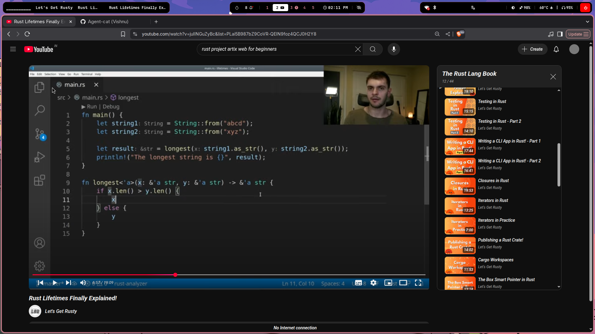
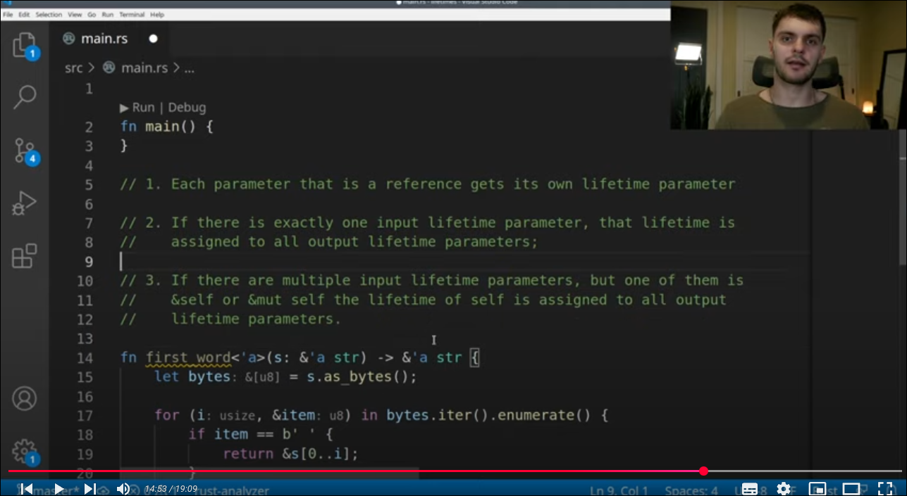

# Lifetimes
---
```rs
fn main() {
    let ans;
    let str1 = String::from("vishnu");
    {
        let str2 = String::from("Vardhan ");
        ans = longest(&str1, &str2);
    }
    print!("{}", ans);
}
fn longest(s1: &str, s2: &str) -> &str {
    // Here we will get error because the ans will be either str1 or str2 if it is str2 as we aretaking reference it will go out of scope after calcluting the ans 
    if s1.len() > s2.len() { s1 } else { s2 }
}
```
- Here we will get error because the ans will be either str1 or str2 if it is str2 as we aretaking reference it will go out of scope after calcluting the ans 
- Here It it will become a dangling pointer 
---
### `How to fix`
```rs
fn main() {
    let ans;
    let str1 = String::from("vishnu");
    {
        let str2 = String::from("Vardhan ");
        ans = longest(&str1, &str2);
        // Here it gives an error that str2 doesnt leave long enough
    }
    print!("{}", ans);
}
fn longest<'a>(s1: &'a str, s2: &'a str) -> &'a str {
    // Here <'a> is a lifetime generic is implies the intersection of the both lifetimes is the return type
    if s1.len() > s2.len() { s1 } else { s2 }
}
```
- Here <'a> is a lifetime generic is implies the intersection of the both lifetimes is the return type
- Here it gives an error that str2 doesnt leave long enough as it gors out of scope and cleared from heap
- So we had to remove the scope from there 
---
## `Structs with lifetimes `
```js
struct User {
    name: &str,
    // It complains as missing life time specifier so use <'a>
}

fn main() {
    let first_name = String::from("Vishnu");
    let user = User { name: &first_name };
    print!("{}", user.name);
}
```
```rs
struct User<'a> {
    name: &'a str,
    // It complains as missing life time specifier so use <'a>
}

fn main() {
    let first_name = String::from("Vishnu");
    let user = User { name: &first_name };
    print!("{}", user.name);
}
```


- return type are output lifetimes args are input lifetimes 


